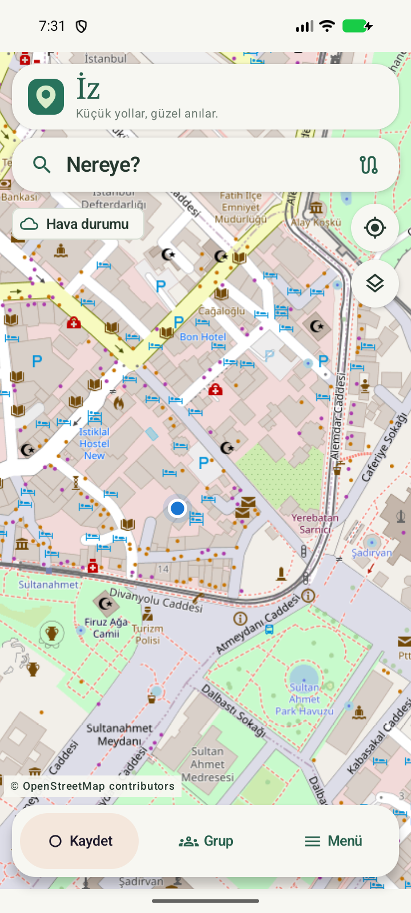
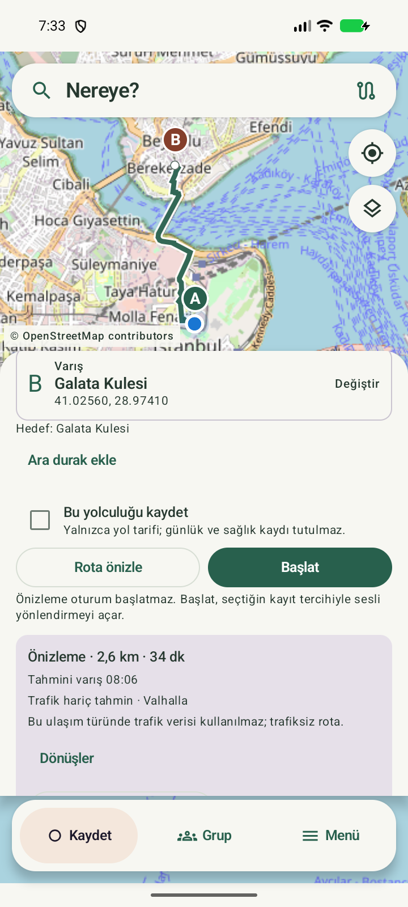

# İz 0.9.2 - navigasyon ve yolculuk günlüğü

**Geliştirme dalı: 0.10.0 / code 18.** Rotalarım, Geziler ve GPX çizgi takibi bu dalda ekleniyor; aşağıdaki indirme bağlantısı doğrulanmış 0.9.2 paketine aittir. [0.10 kullanım rehberi](docs/IZ_010_KULLANIM.md).

[Değişiklik geçmişi](CHANGELOG.md) · [Sürüm değişikliği planı](docs/SURUM_PLANI.md)

Araba, motosiklet, bisiklet, yürüyüş, koşu ve yolcu için haritayla açılan Kotlin / Jetpack Compose uygulaması. Üstte **Nereye?**, yanda konum ve katmanlar, altta **Kaydet / Grup / Menü** bulunur. Yol tarifi günlük kaydı olmadan da çalışır; yeni başlangıçta **Yolculuğu kaydet** seçimi açıktır. Yolculuklar, ziyaretler, özel notlar ve fotoğraflar telefonda saklanır. Geçmiş, istatistikler, yerler, ısı haritası, OSM Topluluğu ve ayarlara Menüden ulaşılır.

Bu depo İz'in kaynak kodunu ve telefon için **0.9.2 (code 17)** önizleme APK'sını yayımlar. Wear OS kaynak sürümü **0.6.0 (code 10)**'dur; bu yayında saat APK'sı bulunmaz. Play Store yayını yapılmamıştır. [0.9 yenilikleri ve kullanım](docs/IZ_090_YENILIKLER.md) · [Kullanım kılavuzu](docs/IZ_080_KULLANIM.md) · [Grup sunucusu kurulumu](docs/GROUP_SETUP.md) · [Saat kartı ve kadran alanı](docs/WATCH_SURFACES.md).

## İndir ve dene

**[İz 0.9.2 telefon APK'sını indir](https://github.com/osmanatayozturk/iz-android/releases/download/v0.9.2/iz-phone-0.9.2.apk)** · [Sürüm notları ve dosyalar](https://github.com/osmanatayozturk/iz-android/releases/tag/v0.9.2)

Android **10 veya üzeri** ve Google Play hizmetleri gerekir. APK'yı telefonda açın; Android isterse dosyayı açtığınız tarayıcı veya dosya yöneticisi için uygulama yükleme izni verin. Konum ve diğer izinler ilgili özellik kullanılırken açıklanır. Otomatik kayıt ilk kurulumda kapalıdır.

Bu paket kişisel API anahtarı, hesap veya yolculuk verisi içermez. Temel harita, rota planlama, hava durumu ve yerel günlük kullanılabilir. TomTom için kendi anahtarınızı, OSM hesabı için kendi public istemci kimliğinizi ayarlayabilirsiniz. Supabase grup bağlantısı bu genel pakette yapılandırılmamıştır; kendi sunucunuzla derleme için [grup kurulumu](docs/GROUP_SETUP.md) belgesini kullanın.

Paket hata ayıklamaya kapalı bir release derlemesidir; mevcut geliştirme sertifikasıyla imzalanmış bir **önizleme** olarak sunulur. Aynı uygulama kimliği ve imzaya sahip önceki kurulumlar yerinde güncellenebilir. Farklı imzalı kurulumlarda Android güncellemeyi reddeder; uygulamayı kaldırmadan önce Ayarlar'dan özel günlüğünüzü yedekleyin. Sürüm ekindeki `SHA256SUMS.txt` dosyası indirilen paketin doğrulanması içindir.

## Uygulamadan görüntüler

Emülatörden alınan gerçek ekranlar; konumlar tanıtım için seçilmiş örneklerdir. Kişisel yolculuk, hesap veya sağlık verisi kullanılmamıştır.

| Ana harita | Rota planlama |
| --- | --- |
|  |  |

0.9.2'de ana haritanın üstünde küçük İz logosu, uygulama adı ve “Küçük yollar, güzel anılar.” sözü yer alır. Bu başlık, rota planlayıcı veya yolculuk açıkken gizlenir. Harita düğmeleri ve görünür alan, başlığın ölçülen yüksekliğine uyum sağlar.

0.9.1'de ısı haritası, geniş renk lekeleri yerine ince GPS izlerini gösterir. Renkler aynı yaklaşık 30 metrelik bölgeden geçen farklı yolculukların sayısını belirtir: **1 mavi, 2–3 turkuaz, 4–7 sarı, 8+ kırmızı**. Aynı yolculukta beklemek veya geri dönmek sayıyı artırmaz. Ulaşım filtreleri renklerin anlamını değiştirmez; açıklama tam ekranda da görünür. Birbirine yakın paralel yollar aynı bölgenin sayısını paylaşabilir. Yolculuk ayrıntılarındaki hız renklendirmesi ayrı kalır; kayıt ve yedek biçimi değişmez.

Supabase grup sunucusu ve TomTom trafik bağlantısı varsayılan kaynak yapılandırmasında etkin değildir. Bunlar sonradan yapılandırılabilir; temel harita, Valhalla tabanlı rota, Open-Meteo hava durumu, navigasyon ve yerel günlük kişisel anahtar olmadan çalışır. Grup arka ucu için [kurulum belgesine](docs/GROUP_SETUP.md) bakın.

[Yol tarifi ve trafik](docs/YOL_TARIFI_VE_TRAFIK.md): mevcut konumdan planlama, sesli yönlendirme ve isteğe bağlı TomTom trafik tahmini.

[OSM Topluluğu](docs/OSM_TOPLULUGU.md) mesajlar, kişiler, hesap ve OSM sitesindeki takip işlemlerini kapsar. [Android Auto](docs/ANDROID_AUTO.md) hedefsiz sürüş kaydı ve navigasyon sunar. Wear OS 0.6.0, kayıt ve navigasyon durumunu telefondan alır; kart ve kadran alanında günlük Samsung Health adımlarını ve ayrı İz kayıtlarını gösterir. Sağlık sensörleri yalnız uygun bir kayıt sırasında çalışır. [Saat desteği ve kimlik geçişi](docs/WATCH_SUPPORT.md) · [Saat sağlık ölçümü](docs/WATCH_HEALTH_LIVE.md) · [Kart ve kadran](docs/WATCH_SURFACES.md).

Altı yolculuk türünde rota havası, kalkış karşılaştırması ve türe özel canlı uyarılar için [hava durumu kullanımına](docs/weather/USAGE.md) bakın.

## 0.10 geliştirmesi

- **Rotalarım:** İki ile beş duraklı planları adlandırın; ulaşım türü, kişisel hız ve yol tercihleri saklanır. Konumum başlangıcı yeniden açılışta güncellenir. Planı açmak kayıt başlatmaz.
- **Yol tercihleri:** Yürüyüş, koşu ve bisiklette **Otoyola girme** varsayılan açıktır. Son seçiminiz her ulaşım türü için ayrı saklanır; kaydedilen plan kendi tercihlerini korur. Bu üç türde otoyolsuzluğu doğrulanamayan rota kullanılmaz.
- **Alternatifler:** Desteklenen planlarda en fazla iki ek güzergâh istenir. Hava karşılaştırması seçilen güzergâha bağlıdır; başlangıçta farklı bir yol sessizce seçilmez.
- **GPX takibi:** GPX 1.0/1.1 izlerini bölüm, yön ve başlangıç seçerek takip edin veya Rotalarım'a kaydedin. GPX takibi günlük kaydından ayrıdır; dönüş talimatı, tahmini varış ve otomatik yeniden rota hesabı sunmaz.
- **Geziler:** Tamamlanmış yolculukları sıralı koleksiyonlarda biriktirin. Koleksiyondan çıkarmak günlük kaydını silmez.
- **Paylaşım ve yedek:** GPX tarih/saat bilgisi her dışa aktarımda varsayılan kapalıdır. Paylaşılan fotoğrafların gömülü üstverileri temizlenir; özgünler korunur. Manuel yedek 7, eski 1–6 yedekleri okuyabilir.

## Açma ve derleme

1. Java **17**, Android SDK **36** ve Android SDK Build Tools **36.0.0** kurun.
2. Depoyu Android Studio ile açın ve SDK yolu için kökteki `local.properties.example` dosyasını `local.properties` olarak kopyalayıp kendi SDK konumunuza göre düzenleyin.
3. Android Studio'nun Gradle JDK ayarını Java 17 olarak seçin ve projeyi eşitleyin.
4. Aşağıdaki komutlarla telefon, saat ve ortak protokolü derleyip test edin.

```powershell
.\gradlew.bat :app:assembleDebug :wear:assembleDebug
.\gradlew.bat :app:testDebugUnitTest :wear:testDebugUnitTest :wear-protocol:test
.\gradlew.bat :app:lintDebug :wear:lintDebug
```

```bash
./gradlew :app:assembleDebug :wear:assembleDebug
./gradlew :app:testDebugUnitTest :wear:testDebugUnitTest :wear-protocol:test
./gradlew :app:lintDebug :wear:lintDebug
```

Genel telefon paketinin derleme görevi `:app:assembleRelease` olur. Temiz çalışma kopyasında `local.properties` yalnız SDK yolunu içermeli; `OSM_CLIENT_ID`, `GROUP_SUPABASE_URL` ve `GROUP_SUPABASE_KEY` ortam/yerel değerleri boş olmalıdır. Çıktı minify edilmiş, hata ayıklamaya kapalı ve imzasızdır; Android Build Tools içindeki `zipalign` ve `apksigner` ile kendi özel sertifikanızla imzalayın. İmzalama anahtarınızı veya parolanızı depoya eklemeyin. Yayımlanan paketin derleme ve test bilgisi sürüm dosyalarındaki `PUBLIC_VERIFICATION.json` içinde bulunur.

Telefon ve saat APK'ları `org.iz.navigation` uygulama kimliğini kullanır. Telefon namespace'i `org.iz.navigation`, saat namespace'i `org.iz.navigation.watch`, ortak protokol namespace'i `org.iz.navigation.wearprotocol`'dür. Önceki uygulama kimliğinden geçiş, Android tarafından yerinde güncelleme sayılmaz; veriyi ZIP ile taşıma adımları [saat desteği belgesinde](docs/WATCH_SUPPORT.md#önceki-uygulama-kimliğinden-geçiş) açıklanır.

OSM hesap girişi, not katkısı ve topluluk özellikleri için public bir `OSM_CLIENT_ID` isteğe bağlıdır. Değer ortam değişkeninden, yerel yapılandırmadan veya uygulamadaki **Ayarlar → OSM uygulama kimliği** alanından verilebilir. İstemci sırrı kullanılmaz. Kimlik olmadan harita, yer arama, günlük, yerel katkı taslakları ve GPX özellikleri çalışır.

## OpenStreetMap ve katkı

MapLibre OpenGL 13.6.1, OSM çevrimiçi harita katmanını gösterir. Harita açılışında konum izniyle mevcut konuma odaklanır. Yer seçimi haritalarında yakınlaştırıp bir yere dokunmak Overpass üzerinden çevredeki OSM nesnelerini getirir; birden fazla aday varsa seçim listesi açılır. Nominatim araması yalnızca **Ara** düğmesiyle gönderilir.

Bu sürüm kişisel kullanım içindir. Uygulamayı çok kullanıcıya dağıtmadan önce arama/yer servislerinin toplam kapasitesini yeniden düzenleyin. Ayarlar → Harita servisleri üzerinden HTTPS adresleri değiştirilebilir. Çevrimdışı bölge indirme yoktur; internet kesilse de GPS günlüğü kaydedilir.

- [OSM harita politikası](https://operations.osmfoundation.org/policies/tiles/): görünür kaynak gösterimi, tanımlayıcı User-Agent, sunucu önbellek kuralları; politika yoksa yedi günlük önbellek. Ön yükleme/toplu indirme kapalıdır.
- [Nominatim politikası](https://operations.osmfoundation.org/policies/nominatim/): uygulama genelinde en fazla saniyede bir istek, önbellek, otomatik tamamlama yok.
- [Overpass kullanımı](https://wiki.openstreetmap.org/wiki/Overpass_API#Public_Overpass_API_instances): günlük 90 sorgu/9 MB sınırı, küçük alan sorguları ve 429/406 yanıtlarında en az 30 saniye bekleme.

**OSM’ye katkı** bölümünde eksik/hatalı yer gözlemleri ayrı taslaklar olarak hazırlanır. Gönderim önizlemesi yalnızca herkese açılacak metni ve konumu gösterir. Özel günlük notları, fotoğraflar ve eski Google kayıtları kendiliğinden aktarılmaz. Gönderilen OSM Notes kayıtlarını gönüllüler inceleyebilir; uygulama doğrudan harita geometrisini değiştirmez. Bağlantı kesilirse belirsiz gönderim otomatik tekrarlanmaz, önce **Durumu kontrol et** kullanılır.

### OSM hesap bağlantısı kurulumu

1. Yeni kimlikle ilk hesap girişinden önce [OSM uygulamalarınız](https://www.openstreetmap.org/oauth2/applications) üzerinden public bir istemci kaydedin: ad `İz`, dönüş adresi `org.iz.navigation:/oauth2redirect`, izinler `read_prefs`, `write_notes`, `write_api`, `consume_messages`, `send_messages`; **Confidential** kapalı. Eski ve yeni kurulum bir süre birlikte kullanılacaksa her biri için ayrı public istemci önerilir. [Topluluk izinlerini etkinleştirme](docs/OSM_TOPLULUGU.md#osm-uygulamasını-hazırlama).
2. Gerçek Client ID değerini yukarıdaki ayara girin. İstemci sırrı kullanılmaz; OSM hesap şifresi uygulamada istenmez.
3. Ayarlar → OSM hesabını bağla, sistem tarayıcısında giriş/onay ve uygulamaya dönüş akışını açar. PKCE S256 ve state kontrolü uygulanır. Oturum Android Keystore ile şifrelenip yedek dışı dizinde saklanır.

Google Maps/Places ve yorum/yıldız ekranları kaldırılmıştır. Telefonun hareket/konum servisleri ve Wear Data Layer korunur. Fotoğraflar Android paylaşım paneliyle paylaşılabilir veya galeriye kaydedilebilir.

## Hareket ve izinler

Kaydı kapalı bir navigasyon oturumunda otomatik kayıt adayı oluşturulmaz. Bunun dışında mevcut otomatik algılama kuralları korunur. İlk kurulumda otomatik algılama kapalıdır. Ayarlar → Hareketi fark et üzerinden açıklamayı okuyup hareket, hassas konum, bildirim ve **her zaman konum** izinlerini vererek etkinleştirin.

Hareket geçişi algılandığında izinler uygunsa sürekli bildirim gösteren konum servisi geçici mesafe ölçümü başlatır. İlk 15 dakika dolmadan güvenilir GPS noktaları arasında toplam 500 metreye ulaşılınca başlangıç rotasıyla birlikte otomatik kaydedilir. Bu süre içindeki dur-kalk sinyalleri mesafeyi sıfırlamaz. 15 dakika dolduğunda açık geçici aday silinir; yeni başlangıç zamanı, boş rota ve sıfır mesafeyle yeni ölçüm penceresi açılır. Aynı hareket türü devam ederken yeni bir hareket geçişi gelmesi gerekmez; eski GPS noktaları ve mesafe yeni pencereye taşınmaz. Konum gelmese de servis zaman kontrolü yapar; Android çalışmayı geciktirirse ilk çalışma fırsatında sıfırlanır. Tam 15:00 sınırındaki GPS noktası eski adayı kalıcılaştırmaz. Elle başlatılmış veya kalıcı kayda dönüşmüş yolculuklar bu sınırdan etkilenmez. Kullanıcının bitirdiği geçici kayıtların 24 saatlik saklama süresi korunur. Bilerek reddedilen yolculuk aynı hareket sürerken tekrar açılmaz.

Araba ve motosiklet otomatik ayırt edilemez. Ulaşım türü elle değiştirilebilir; kaydın türünü düzeltmek yolculuğun tamamını yeniden sınıflandırır. Yolcu kayıtları kendi araba/motosiklet sürüşlerinden ayrı filtrelenir. Varsayılan 10 dakika duruş sonrası durak/bitirme önerisi gelir; otomatik bitirme yapılmaz. Bir geçici yolculuğa bilerek ziyaret veya fotoğraf kaydetmek onu kalıcılaştırır.

GPS'in doğruluğu, Android güç yönetimi ve cihaz üreticisi kayıt sürekliliğini etkiler. Zorla durdurma sonrası arka planda yeniden başlatma garanti edilmez. Kesintiler işaretlenir; kaydedilmeyen yol haritada birleştirilmez. Algılama kullanılamıyorsa elle başlatma uygulanır.

## Koşu ve Samsung Health

Koşu telefon/saat menülerinde ve ısı haritasında ayrı bir moddur. Otomatik RUNNING hareketi yeni koşu adayı açar; aktif koşu kısa yürüyüş veya duraklamayla bölünmez. Ortalama tempo duraklamalar dâhil toplam süre / kaydedilmiş GPS mesafesidir. Telefon adımları yürüyüş ve koşuda ölçülür; aynı kaydın bu iki tür arasında düzeltilmesi adımları korur.

İz Ayarlar → Samsung Health → Samsung Health'i bağla yoluyla nabız, toplam kalori ve adım okuma izinlerini verin. Samsung Health Ayarlar → Health Connect bölümünde bu verilerin paylaşımını açın. Cihaz destekliyorsa İz'deki ayrı arka plan izniyle dönemsel eşitleme açılır; destek/izin yoksa uygulama açıkken eşitlenir. Bağlantı ilk kurulumda kapalıdır.

Yalnız Samsung Health kaynaklı, cihazı saat olarak belirtilmiş ölçümler alınır. Saat metadata'sı bilekte kalma süresini kanıtlamaz. İlk erişilebilen 30 gündeki ve yeni onaylanmış yolculuklar eşleştirilir. Ölçümler gecikebilir; Samsung Health tüm yolculuklar için kalori üretmeyebilir. Toplam kalori aktif kalori değildir; aralıklar oranlanmaz, boşluklar doldurulmaz. Telefon/saat adımları ayrı gösterilir. İz egzersiz başlatmaz veya sağlık kayıtlarına yazmaz.

Yedek sürümü 6, sürüm 1–5'i okur. Sağlık ölçümlerini yedeğe eklemek her dışa aktarımda varsayılan kapalıdır; eşitleme işaretçileri ve izinler yedeklenmez. Sağlık verileri OSM, GPX ve fotoğraf paylaşımına eklenmez. Aynı uygulama kimliğini kullanan önceki telefon/saat protokol sürümleriyle uyumluluk korunur; eski ve yeni uygulama kimliğine sahip karma telefon-saat çiftleri iletişim kurmaz.

## Veri ve yedek

Room sürüm 6: yolculuklar, rota noktaları, yerler, ziyaretler, fotoğraf bilgileri ve OSM katkı taslakları. Eski Google kimlikleri/puanları/taslakları arşiv uyumluluğu için korunur; aktif paylaşım akışında kullanılmaz. Fotoğraf kopyaları uygulamanın özel `files/photos/` klasöründedir. Analitik veya otomatik günlük yüklemesi yoktur. İsteğe bağlı grup özelliği ayrı Supabase sunucusunu kullanır; günlük, sağlık ve fotoğraflar gruba yüklenmez. Sunucuda grup üyeliği, ortak duraklar ve izin/zaman bilgileri tutulur; canlı koordinatlar yalnız paylaşım açıkken aktarılır ve geçmiş olarak saklanmaz. Harita alanları ve arama metinleri seçilen OSM servislerine gönderilir. OSM hesabı yalnızca kullanıcı bağlantı kurduğunda kullanılır.

Android otomatik bulut yedeği ve cihaz transferi uygulama verileri için kapalıdır. Ayarlar'dan sürümlü ZIP dosyasına manuel yedek alınabilir. Yedek özel konumları ve fotoğrafları içerir; uygulamayı kaldırmadan önce güvenli bir yere kaydedin. Geçici rotalar yedeğe alınmaz. Geri yükleme dosyayı doğruladıktan sonra mevcut günlüğü değiştirir; açık yolculuklar bitmiş/kesilmiş olarak içeri alınır ve takip kendiliğinden başlatılmaz.

## Doğrulama

```powershell
.\gradlew.bat :app:connectedDebugAndroidTest :wear:connectedDebugAndroidTest
```

Bu komutlar bağlı uygun telefon ve Wear OS cihazı ya da emülatörü gerektirir. [Gerçek cihaz kabul listesi](docs/DEVICE_TESTS.md), hareket algılama, Android Auto, telefon-saat bağlantısı ve pil etkisi gibi fiziksel donanım gerektiren kontrolleri ayrıca tanımlar.

## Yapı

- `data`: Room, kayıt kuralları, süre/mesafe hesaplama, ZIP yedekleme.
- `tracking`: hareket geçişleri, konum servisi, bildirimler, süre sonu temizliği.
- `integration`: MapLibre harita, OSM arama, OAuth/Notes, GPX, fotoğraf içe alma ve paylaşım.
- `navigation`: günlük kaydından bağımsız canlı yolculuk oturumu, rota ve yönlendirme.
- `group`: grup üyeliği, açık konum paylaşımı izni ve Supabase bağlantısı.
- `ui`: tam ekran ana harita, rota planlayıcı, Menü üzerinden geçmiş/istatistikler/yerler/ayarlar, kayıt ayrıntıları, özel notlar, OSM katkı taslakları ve GPX önizlemesi.

Başlangıç sürümü Android 10+ ve Google Play hizmetlerini hedefler. Play Store yayını yapılmamıştır; mağaza yayını öncesinde arka plan konum beyanı, gizlilik metni, yayın imzası ve güncel hedef SDK gereksinimleri tamamlanmalıdır.

## Rotalar, istatistikler ve adımlar

Ana harita güncel konumu, planlama sırasında önizlenen güzergâhı ve aktif yolculukta yönlendirme rotasını gösterir. Günlük kaydı açıksa o kaydın izi ayrı renkle çizilir; boşta geçmiş rota çizgileri gösterilmez. Eski yolculuklar ve kaydedilmiş yerler Menüden açılır. Her yolculuk kaydı kendi rotasını ve GPS boşluklarını korur. Haritayı sürüklemek konum takibini durdurur; Konumum düğmesi yeniden güncel konuma döner. Rota önizlemesi Katmanlar menüsünden görünür harita alanına sığdırılabilir.

Yolculuk ayrıntısında mesafe, toplam süre, ortalama hız, en yüksek ölçülen aralık hızı, hareketli ortalama hız, hareket süresi, ölçülen duraklama ve GPS ölçüm süresi bulunur. GPS boşlukları duraklama sayılmaz. Ortalama hız mesafeyi toplam süreye böler; eksik GPS varsa eksik mesafe tamamlanmış gibi gösterilmez.

Yürüyüş adımları telefonun donanım sayacından (yoksa adım algılama sensöründen) alınır. Fiziksel aktivite izni veya sensör yoksa adım sayısı tahmin edilmez. İlk sayaç ölçümü başlangıç referansıdır; kayıt öncesindeki adımlar ve gözlenmeyen aralıklar eklenmez. Eski kayıtlara geriye dönük adım hesaplanmaz. 0.9.0 kalıcı yer sırası için Room sürüm 6 ve yedek sürüm 6 kullanır; yedek sürümleri 1–5 okunabilir. Geri yüklenen yarım kalmış OSM gönderimleri kontrol bekleyen duruma dönüşür; otomatik yayımlanmaz.

Tamamlanmış kalıcı yolculukların ayrıntısından **GPX rotasını dışa aktar** seçilir. Önizlemede başlangıç/bitiş kısaltılır ve Android dosya seçicisiyle GPX 1.1 kaydedilir. GPS boşlukları ayrı rota bölümleridir; özel başlık/not/fotoğraflar eklenmez ve dosya otomatik OSM’ye yüklenmez.

Menü → Isı haritasında Tümü ve ulaşım türleri ayrı seçilir. Yalnızca kalıcı kayıtlardaki ölçülmüş konumlar kullanılır. Her yolculuk yaklaşık 30 metrelik bölgede bir kez sayılır; aynı yerde beklerken sık gelen GPS ölçümleri yoğunluğu yapay olarak artırmaz.

## Galaxy Watch8 Classic

Telefona bağlı Wear OS sürümü `wear/` modülündedir. Altı ulaşım türü, başlatma/bitiş kontrolleri, canlı telefon ölçümleri ve otomatik adayın 500 metre / 15 dakika ilerlemesi saatten izlenebilir. Android arka plan başlangıcını engellediğinde telefon bildirimi veya telefon uygulamasındaki onay ekranı kullanılır.

Telefon ve saat uygulamaları aynı `org.iz.navigation` uygulama kimliği ve aynı imzayla ayrı cihazlara kurulmalıdır. Bağımsız saat GPS'i ve saat sensöründen adım kaydı bu sürümde yoktur. Ayrıntılar: [Wear OS desteği](docs/WATCH_SUPPORT.md).

## Lisans ve üçüncü taraflar

Copyright © 2026 İz projesine katkıda bulunanlar. Bu depodaki özgün kaynak kod [GNU General Public License v3.0 only](LICENSE) (`GPL-3.0-only`) koşullarıyla yayımlanır; Google Play Services istemcileriyle APK dağıtımı için dar kapsamlı [ek bağlama izni](ADDITIONAL_PERMISSION.md) bulunur. Depodaki üçüncü taraf bileşenler kendi lisansları altında kalır; GPL bildirimi onların lisanslarının veya gerekli kaynak gösterimlerinin yerini almaz. Ayrıntılar [üçüncü taraf bildirimlerinde](THIRD_PARTY_NOTICES.md) bulunur.

Harita ve yol verisi © OpenStreetMap katkıcılarıdır; uygulama içindeki ve belgelerdeki OpenStreetMap kaynak gösterimleri korunmalıdır. MapLibre, AndroidX, AppAuth, OkHttp, Health Connect istemcisi ve diğer bağımlılıkların lisans koşulları ayrıca geçerlidir.

Kaynak kod, Google Play Services konum ve Wearable Data Layer bağımlılıklarını kullanır. Google Play Services tescilli bir çalışma zamanı bileşenidir ve bu depoda GPL kapsamında yeniden lisanslanmaz. APK ile eşleşen İz kaynak kodu, üçüncü taraf lisansları ve bağımlılık kaynakları [aynı sürümün dosyaları](https://github.com/osmanatayozturk/iz-android/releases/tag/v0.9.2) üzerinden sağlanır.
